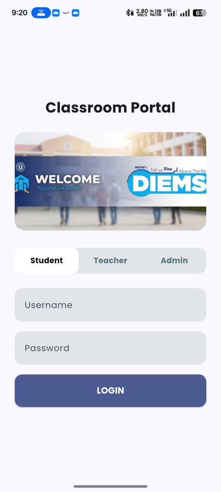
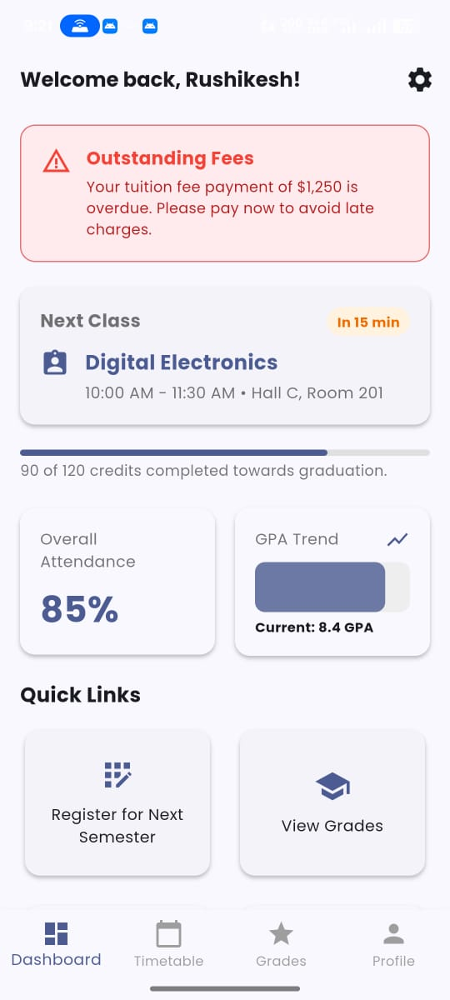
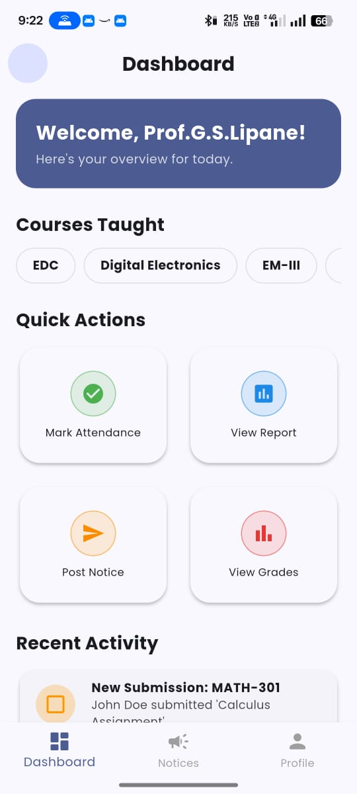
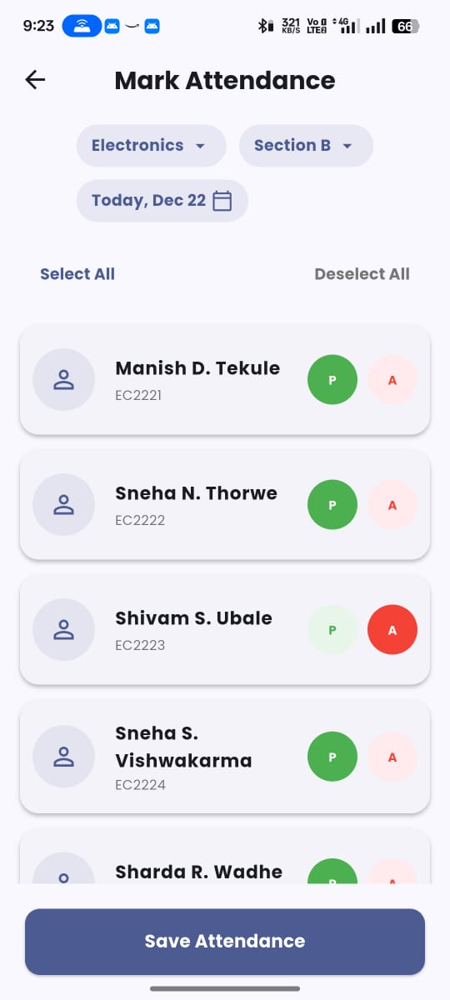
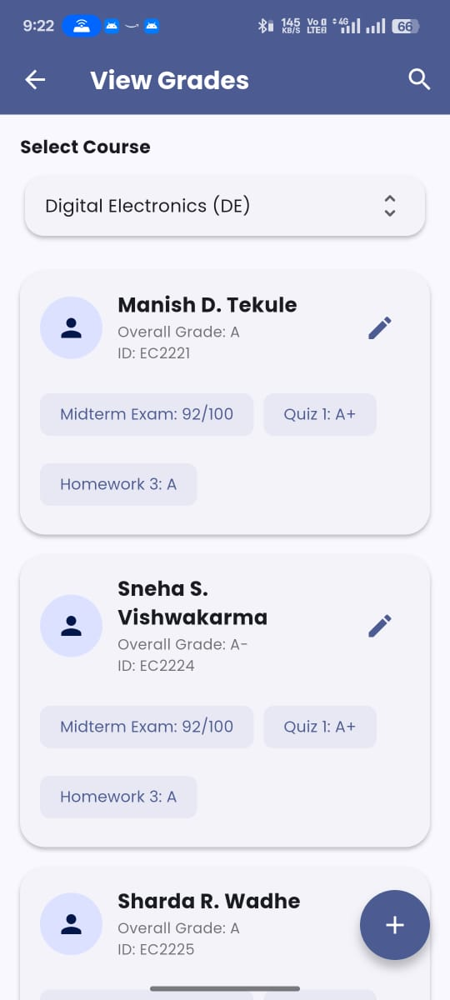
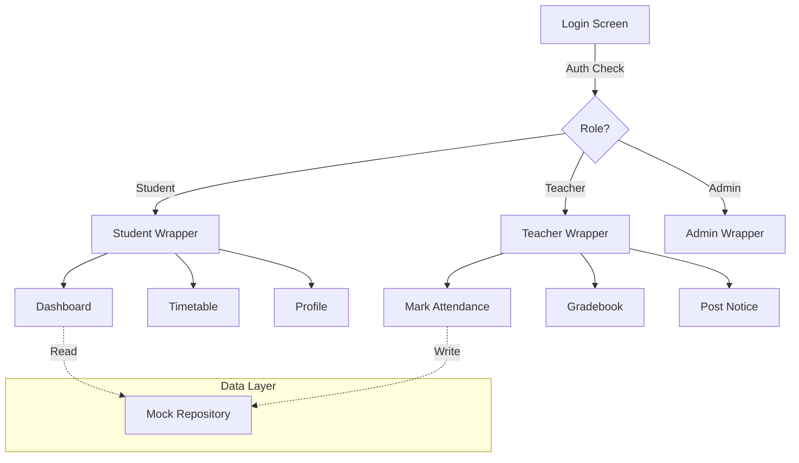

# 🎓 College Portal - Unified Academic Management System


> A comprehensive, cross-platform Digital Student Operations (DSO) solution connecting Students, Teachers, and Administrators in a single, secure environment.

## 📱 Project Overview

**College Portal** is a role-based Flutter application designed to digitize and streamline daily academic operations. It solves the problem of fragmented communication and manual record-keeping by providing real-time synchronization between stakeholders.

The application features a responsive design that adapts seamlessly between **Mobile** (Android/iOS) and **Desktop** (Windows/macOS) environments.

## 🌟 Key Features

### 🔐 Role-Based Access Control (RBAC)
Secure authentication routes users to specific dashboards based on their role:
* **Student:** Read-only access to personal academic data.
* **Teacher:** Write access to grades, attendance, and notices.
* **Admin:** Full system oversight and user management.

### 👨‍🎓 Student Module
* **Dashboard:** Visual overview of CGPA, Attendance %, and Active Credits.
* **Smart Timetable:** Interactive weekly schedule with current day highlighting.
* **Academic History:** Detailed view of past semesters and grades.
* **Digital Notice Board:** Real-time updates on exams, holidays, and events.

### 👩‍🏫 Teacher Module
* **Digital Gradebook:** Interface to view rosters and assign grades instantly.
* **Quick Attendance:** "One-Tap" attendance marking system with `P/A` toggles.
* **Notice Creation:** Tools to draft and broadcast announcements to specific batches.
* **Performance Analytics:** Visual charts tracking class attendance trends.

## 📸 Screenshots

| Login Page | Student Dashboard |
| :---: | :---: |
|  |  |

| Teacher Dashboard | Attendance Marking |
| :---: | :---: |
|  |  |


| Digital Gradebook | |
| :---: | :---: |
|  | |

## 🛠️ Technical Stack

| Component | Technology | Description |
| :--- | :--- | :--- |
| **Framework** | Flutter (Dart) | Cross-platform UI toolkit. |
| **Architecture** | Modular Layered | Separation of Data, UI, and Logic. |
| **State Management** | Local State | Efficient `setState` and Constructor Injection. |
| **UI Design** | Material 3 | Modern, accessible design system. |
| **Data Persistence** | Mock Repository | Simulated NoSQL structure for rapid prototyping. |
| **Charts** | `fl_chart` | Interactive data visualization. |
| **Hardware Access** | `mobile_scanner` | QR Code integration for ID verification. |

## 🚀 Getting Started

Follow these steps to run the project locally.

### Prerequisites
* [Flutter SDK](https://flutter.dev/docs/get-started/install) (v3.0+)
* Visual Studio Code or Android Studio
* (Optional) Visual Studio 2022 C++ Workload (for Windows Desktop support)

### Installation

1.  **Clone the repository:**
    ```bash
    git clone [https://github.com/ItsRuShi1/college-portal.git]
    cd college-portal
    ```

2.  **Install dependencies:**
    ```bash
    flutter pub get
    ```

3.  **Run the app:**
    * *For Mobile:* Connect a device or start an emulator.
    * *For Desktop:* Ensure your OS is set up for Flutter desktop.
    ```bash
    flutter run
    ```

## 🏗️ Architecture Diagram



## 👥 Contributors

This project was a successful collaboration between:

* **[Rushikesh Gadade]** - *Lead Developer* - [@ItsRuShi1](https://github.com/ItsRuShi1)
    * Developed core authentication logic and the Student Dashboard module.
    * Implemented global theme persistence using `SharedPreferences`.

* **[Chaitanya Bolake]** - *Co-Developer* - [@ChaitanyaBolake](https://github.com/ChaitanyaBolake)
    * Architected the Teacher Module and Digital Register logic.
    * Designed the responsive UI layouts for both mobile and desktop views.

* **[Aniket Agarkar]** - *Co-developer* - [@AniketSAgarkar](https://github.com/AniketSAgarkar)
    * Developed Admin Main Wrapper and Dashboard.
    * Build Data Base for the Implementation of RBAC.


